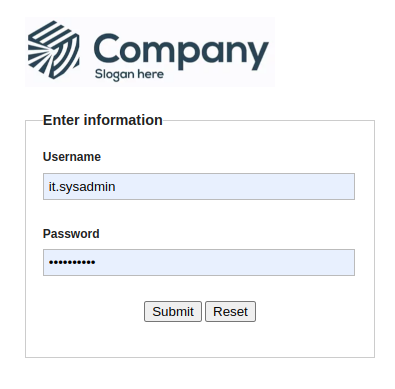
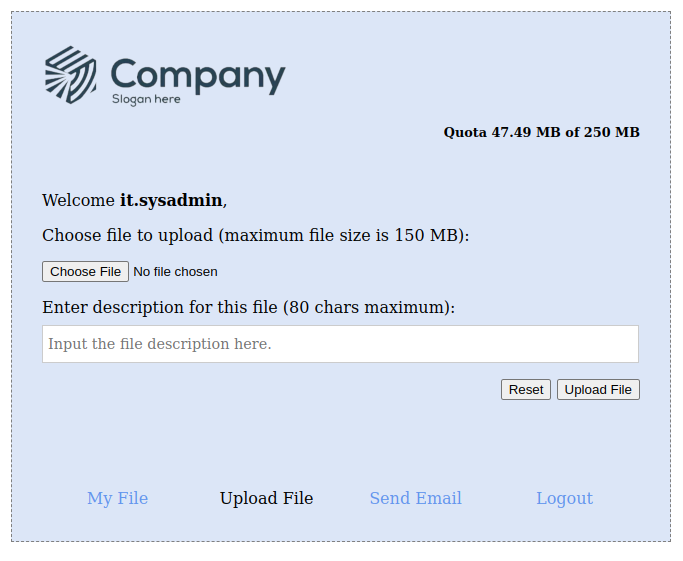
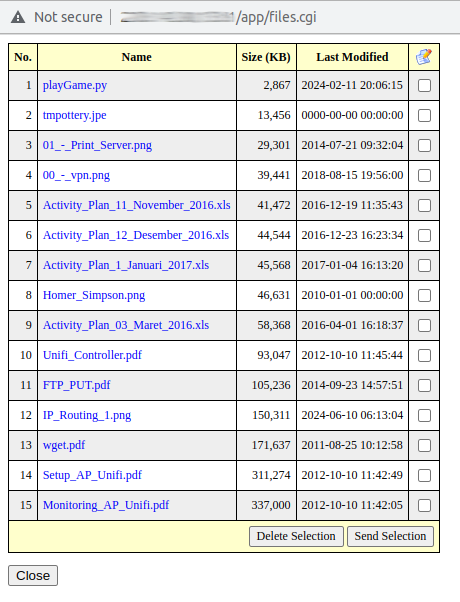
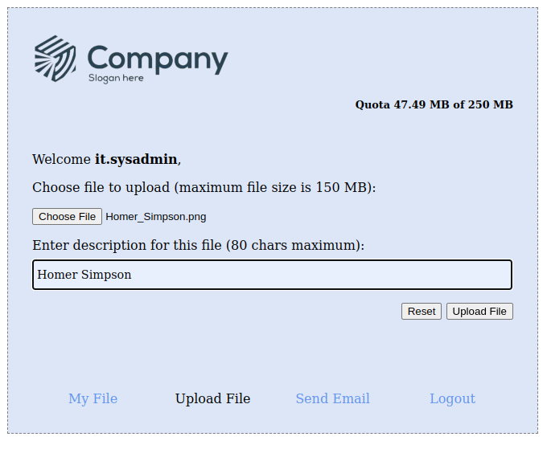
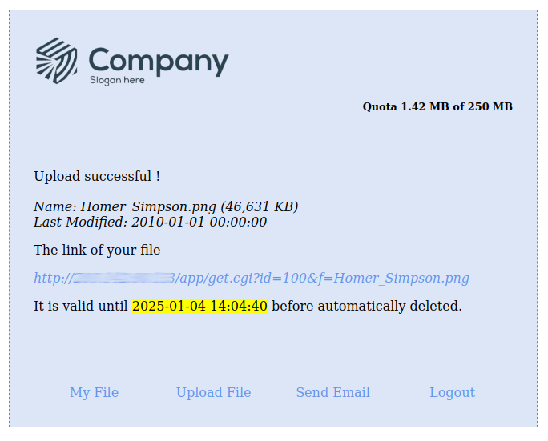
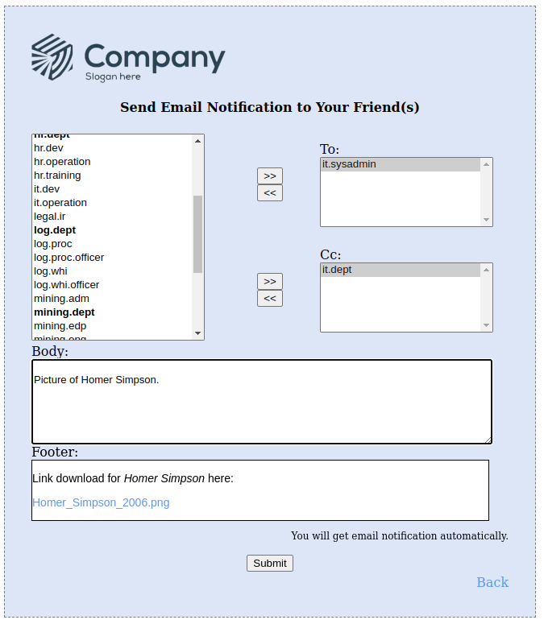
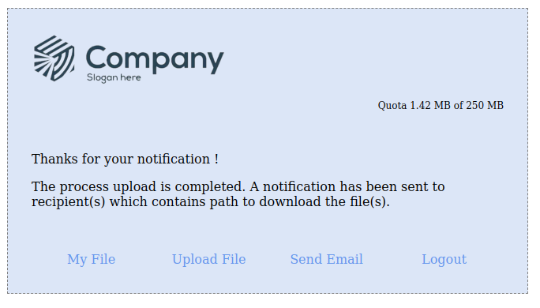
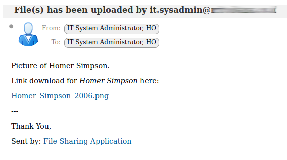

# File Sharing (CGI Application)

The File Sharing is a web application written in Perl CGI to upload a file to a server 
and sharing it with other users by notifying them the download link.

Usually people send a file through email as an attachments. Attachments can be any type of 
file, such as documents, images, or videos, and used for sharing information between 
individuals or teams. Email services have limits on the size of attachments that can be sent. 
Such as Gmail has a capacity up to 25 MB in the email attachment.

If a user send a file to a group of people with the same domain then the server mail will keep 
it per account basis. For example if you send a file to a group of 5 accounts with the same domain 
then the server mail must allocate storage for 5 x the file size to keep that files. That wastes of storage.

Instead of sending file via email attachment, a user can upload it to another storage like NAS or
Network Access Storage then he / she can notify who needs it via email message which contain a 
link to download.

## Requirement

You must install web server (httpd or nginx), mysql and perl cgi.

Packages installation in CentOS 5.11.

Httpd and perl

    yum install httpd openssl mod_ssl mod_perl

Perl Modules

    yum install perl-File-Slurp-Tiny perl-JSON perl-CGI-Session perl-File-Slurp perl-Crypt-CBC perl-Crypt-OpenSSL-Random \
      perl-Crypt-OpenSSL-RSA perl-Crypt-OpenSSL-AES perl-Convert-PEM perl-Email-Valid perl-HTML-Template perl-DBD-CSV perl-Authen-SASL \
      perl-Crypt-RC4 perl-DateTime perl-File-MimeInfo

PHP, Perl and LDAP

    yum install mysql php nss_ldap php-ldap perl-LDAP php-gd perl-DBD-MySQL perl-DBD-SQLite perl-DBD-AnyData mysql-server php-mysql libdbi-dbd-mysql

## Basic Configuration

### Edit file /etc/httpd/conf/httpd.conf

Edit file `/etc/httpd/conf/httpd.conf`

    ...
    Options FollowSymLinks IncludesNoExec +ExecCGI
    ...
    DirectoryIndex index.html index.html.var index.cgi
    ...
    AddHandler cgi-script .cgi

Restart httpd.

### Test if CGI is working

Save the file `test.cgi` to the root html directory `/var/www/html`.

Then make executable

```
chmod 755 /var/www/html/test.cgi
```

Test if cgi is working by using curl

    curl http://localhost/test.cgi

The output

```html
<html><head><title>Perl Environment Variables</title></head>
<body>
<h1>Perl Environment Variables</h1>
DOCUMENT_ROOT = /var/www/html<br>
GATEWAY_INTERFACE = CGI/1.1<br>
HTTP_ACCEPT = */*<br>
HTTP_HOST = localhost<br>
HTTP_USER_AGENT = curl/7.15.5 (i386-redhat-linux-gnu) libcurl/7.15.5 OpenSSL/0.9.8b zlib/1.2.3 libidn/0.6.5<br>
PATH = /sbin:/usr/sbin:/bin:/usr/bin<br>
QUERY_STRING = <br>
REMOTE_ADDR = 127.0.0.1<br>
REMOTE_PORT = 46564<br>
REQUEST_METHOD = GET<br>
REQUEST_URI = /test.cgi<br>
SCRIPT_FILENAME = /var/www/html/test.cgi<br>
SCRIPT_NAME = /test.cgi<br>
SERVER_ADDR = 127.0.0.1<br>
SERVER_ADMIN = root@localhost<br>
SERVER_NAME = localhost<br>
SERVER_PORT = 80<br>
SERVER_PROTOCOL = HTTP/1.1<br>
SERVER_SIGNATURE = <address>Apache/2.2.3 (CentOS) Server at localhost Port 80</address>
<br>
SERVER_SOFTWARE = Apache/2.2.3 (CentOS)<br>
</body></html>
```

### Create application directory

The web application will be kept on the root html directory `/var/www/html`.
Go to the root html directory and extract the file `app-full.zip`.

    cd /var/www/html
    unzip app-full.zip

### Create directory for file storage

You can keep the uploading files to local directory at the server web.

    mkdir -p /data/upload

Change ownership of that directory to owner of the httpd server, in this case is apache.
    
    chown apache /data/upload

>You can mount a shared NFS directory on a particular mount point in the local directory.

### Create database smscgi

Login to mysql as user root

```sql
CREATE DATABASE webupload;
CREATE USER 'user1'@'localhost' IDENTIFIED BY 'password1';
GRANT ALL PRIVILEGES ON `webupload` . * TO 'user1'@'localhost';
EXIT;
```

Then execute sql statements to import file `webupload.db`.

```
mysql -u user1 -p webupload < webupload.db
```

## Script Configuration

You can edit the value or constants at module `/var/www/html/app/My/Session.pm`.

    # Directory
    use constant UPLOADDIR => '/data/upload';
    use constant EMAILALL  => '/var/www/html/app/data/emails.all.txt';
    use constant EMAILLIST  => '/var/www/html/app/data/emails.list.txt';
    use constant SESIDIR   => '/var/www/session';
    use constant IDLEXPIRE => 3600; # '+1h' or 3600 seconds
    use constant EXPIRE    => '+1d';
    use constant LOGOUTEXP => 'Thu, 01-Jan-1970 00:00:00 GMT';
    use constant LOGINPAGE => 'index.cgi';
    use constant QUOTAMAX  => 262144000; # 250 MB
    # Maxiumum file size to upload also edit MAXFILESIZE on ../../html/js/functions.js
    use constant MAXFILESIZE => 150; # 150 MB
    # Set how many days file will be kept on the server (0 means will be keep forever)
    use constant UPTIME => 120;
    # Authentication using LDAP
    use constant DOMAIN => 'domain.org';
    use constant PROTOCOL  => 'LDAP';
    use constant MAILSERVER => 'mail.domain.org';
    # BCC
    use constant BCC => 'admin';
    # MySQL
    use constant DB => 'webupload';
    use constant HOSTDB => 'localhost';
    use constant PORTDB => '3306';
    use constant USERDB => 'user1';
    use constant PASSDB => 'password1';

### Email

*EMAILALL* this refer to a file which contains all emails user plus all email distribution lists.

*EMAILLIST* this refer to a file which contains all email distribution lists.

### QuotaMax

*QUOTAMAX* is a maximum storage in Bytes for a user to keep the file(s) on the server.

### Max file size

*MAXFILESIZE* is a maximum file size in MB a user can upload.

### Uptime

*UPTIME* is how long in days the file will be kept on the server before removed aumotically.

>You should create a cronjob to remove the file(s) which has an access time more than UPTIME.

### Authentication Method

There are two protocols that supported.

- LDAP
- POP3

### BCC

This is the email address which will be get all the notification emails sent by user.

The rests are self explanatory.

## How to Use The Application

### Login to Application

In this example you can login using your email account.



### Choose the File to Upload

You choose the file to upload by click *Choose File* button.



Alternatively, if you already have some files on the server you can click *My File* button and select 
one or more file(s). Then click *Send Selection* button, close the popup, finally click *Send Email* button.



### Upload the File

Click the button *Upload File*.



### Successful Upload the File



The file will be saved at the server include with the last modified time.

You can click *Send Email* button.

### Send Email Notification

Select the email address on the left you want to email. Or you can select the distribution list email 
in the **boldface**.

Click the button *Submit* to send the email(s).



### The Email is Being Delivered



### The Message on Your Inbox

You will get the notification email like this.




